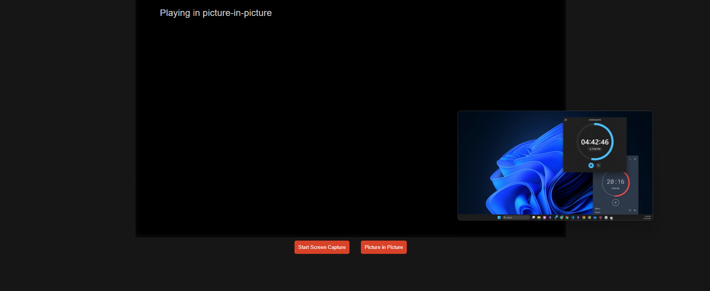

# picture-in-picture

This project demonstrates how to use the **Screen Capture API** and **Picture-in-Picture API** to capture the user's screen and display it in a floating video window.

It allows users to:
- Start screen sharing (a tab, window, or entire display)
- View the shared screen inside the page
- Toggle Picture-in-Picture mode to float the screen video in a mini-window

---
## Live Demo

👉 [Click here to try the demo](https://abdo-rabea.github.io/picture-in-picture)  


---
## Features

-  Screen capture using `navigator.mediaDevices.getDisplayMedia()`
-  Picture-in-Picture mode using `video.requestPictureInPicture()`
-  Graceful handling of stream ending and PiP toggling

---
## Screenshot

  

---
## How to Use

1. Clone the repo or download the files:
```bash
git clone git@github.com:Abdo-Rabea/picture-in-picture.git
```
2. Open `index.html` in a browser (or use a live server).
3. Click **“Start Screen Capture”** to choose a screen to share.
4. Click **“Picture in Picture”** to pop out the screen into a floating window.
